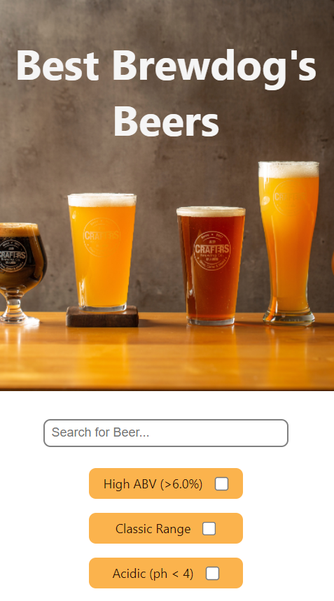
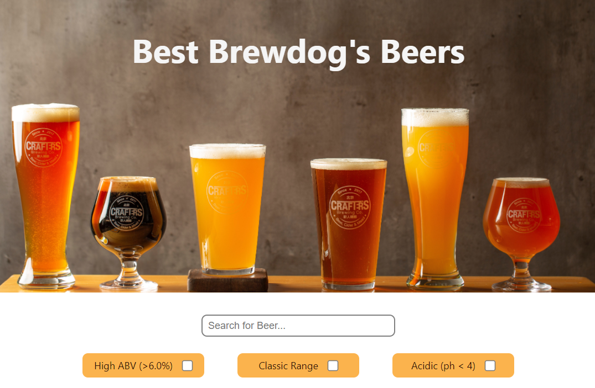
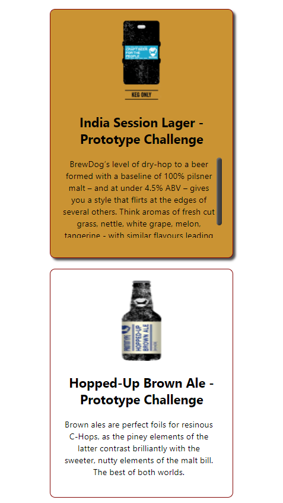
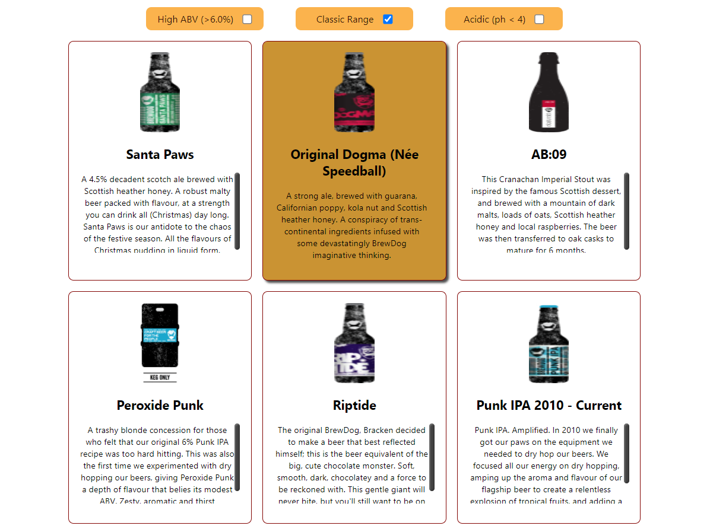

# Punk API
This app fetches the [Punk API](https://punkapi.com/documentation/v2) and displays a list of beers which can then be filtered by:

* Name
* High ABV (Alcohol content greater than 6%)
* Classic Range (Brewed before 2010)
* Acidity (PH level less then 4)

# Demo
Deployed using Netlify:

https://punk-api-beers.netlify.app/

# Tech Stack

* React + JSX using functional components
* SCSS / CSS
* JavaScript

# Screenshots

## Filters for Mobile

## Filters for Desktop

## Beer Cards for Mobile

## Beer Cards for Desktop

# Credits

* [Punk API](https://punkapi.com/documentation/v2)
* [Netlify](https://www.netlify.com/)
